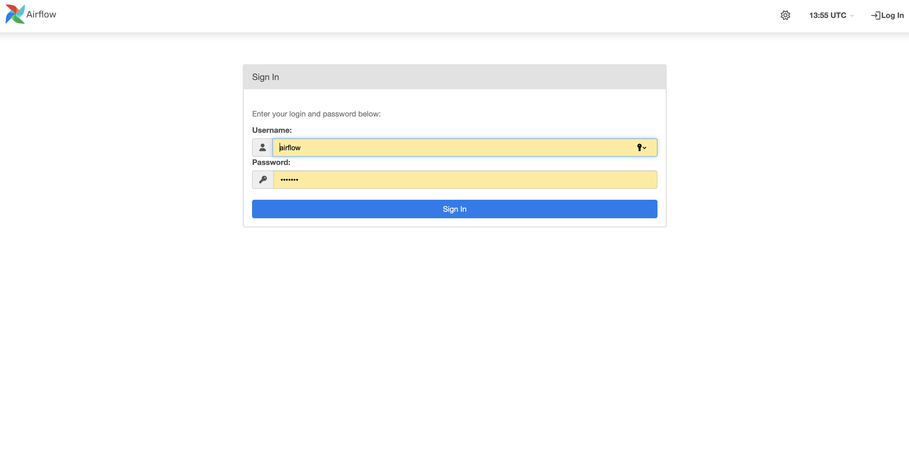
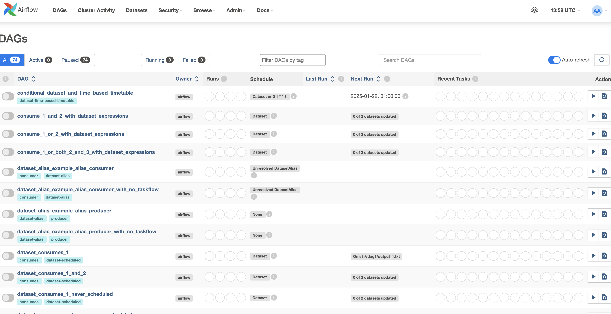

# Simulative. Webinar: FastApi + Airflow + Postgres + Clickhouse

## 1. Подготовим окружение

Создадим файл `.gitignore`

```bash
touch .gitignore
echo .idea >> .gitignore
echo .venv >> .gitignore
echo .env >> .gitignore
```

Инициализируем репозиторий

```bash
git init
```

Создадим виртуальное окружение

```bash
python -m venv .venv
source .venv/bin/activate
```

Установим необходимые зависимости

```bash
pip install -r requirements.txt
```

Настроим pre-commit

```yaml
# .pre-commit-config.yaml

repos:
  - repo: https://github.com/pre-commit/pre-commit-hooks
    rev: v4.5.0
    hooks:
      - id: check-merge-conflict
      - id: trailing-whitespace
        args: [--markdown-linebreak-ext=md]
      - id: end-of-file-fixer
      - id: check-toml
      - id: check-yaml
        args: ["--unsafe"]
      - id: check-symlinks
      - id: check-added-large-files
        args: ["--maxkb=500"]
      - id: requirements-txt-fixer
      - id: detect-private-key

  - repo: https://github.com/psf/black
    rev: 24.2.0
    hooks:
      - id: black
        args:
          - --line-length=99
          - --exclude=/.venv/

  - repo: https://github.com/PyCQA/flake8
    rev: 7.0.0
    hooks:
      - id: flake8
        args:
          - --max-line-length=99
 ```

Установим pre-commit

```bash
pip install pre-commit
pre-commit install
```

Создадим makefile

```bash
# Makefile

SHELL := /bin/bash
PY = .venv/bin/python

.PHONY: up-services down-services up-db down-db up-af down-af lint

lint:
	pre-commit run --all-files
	pre-commit run --all-files

up-services:
	docker-compose -f docker-compose-services.yaml up -d --build

down-services:
	docker-compose -f docker-compose-services.yaml down -v

up-db:
	docker-compose -f docker-compose-db.yaml up -d --build

down-db:
	docker-compose -f docker-compose-db.yaml down -v

up-af:
	docker-compose -f docker-compose-af.yaml up -d --build

down-af:
	docker-compose -f docker-compose-af.yaml down -v
```

Подготовим файлы `.env` и `.env.example` с переменными окружения

```bash
# .env

PG_HOST=pg
PG_PORT=5432
PG_USER=postgres
PG_PASSWORD=postgres
PG_DATABASE=postgres
CH_HOST=ch
CH_PORT=8123
CH_USER=default
CH_PASSWORD=password
CH_DATABASE=default
AIRFLOW_UID=50000
AIRFLOW_GID=0
AIRFLOW_PROJ_DIR=./airflow
```

## 2. Напишем сервис на FastAPI, который будет генерировать фейковых пользователей

Создадим директорию нашего сервиса

```bash
mkdir fakerApi
```

Подготовим файл с зависимостями нашего сервиса

```bash
pip freeze >> fakerApi/requirements.txt
```

Подготовим Dockerfile для создания [Docker](https://www.docker.com/) образа нашего сервиса

```bash
# Dockerfile

FROM python:3.12-slim

WORKDIR /app

COPY requirements.txt .
RUN pip install --no-cache-dir -r requirements.txt

COPY . .

CMD ["uvicorn", "app.app:app", "--host", "0.0.0.0", "--port", "8000"]
```

Создадим директории нашего [FastAPI](https://fastapi.tiangolo.com/) приложения

```bash
mkdir app
mkdir app/models
touch app/models/person.py
mkdir app/handlers
touch app/handlers/person.py
touch app/app.py
```

Напишем модель ответа нашего приложения

```python
# fakerApi/app/models/person.py

import datetime
from pydantic import BaseModel
from typing import Optional


class PersonResponse(BaseModel):
    name: str
    age: int
    address: str
    email: str
    phone_number: str
    registration_date: datetime.datetime
    created_at: datetime.datetime
    updated_at: datetime.datetime
    deleted_at: Optional[datetime.datetime] = None
```

Напишем обработчик запроса к нашему приложению

```python
# fakerApi/app/handlers/person.py

from fastapi import APIRouter
from faker import Faker
from app.models.person import PersonResponse

router = APIRouter(prefix="/person", tags=["person"])

faker = Faker(locale="ru_RU")


@router.get("/", response_model=PersonResponse)
async def get_person():
    person = PersonResponse(
        name=faker.name(),
        age=faker.random_int(min=18, max=99),
        address=faker.address(),
        email=faker.email(),
        phone_number=faker.phone_number(),
        registration_date=faker.date_time_between(start_date="-1y", end_date="now"),
        created_at=faker.date_time_between(start_date="-1y", end_date="now"),
        updated_at=faker.date_time_between(start_date="-1y", end_date="now"),
        deleted_at=None,
    )
    return person
```

Напишем логику точки входа в наше приложение

```python
# fakerApi/app/app.py

import uvicorn
from fastapi import FastAPI
from app.handlers.person import router as person_router

app = FastAPI()

app.include_router(person_router)


@app.get("/")
async def root():
    return {"message": "Hello, Simulative!"}


if __name__ == "__main__":
    uvicorn.run(app, host="0.0.0.0", port=8000)
```

Напишем `docker-compose-services.yaml` для нашего сервиса

```bash
# docker-compose-services.yaml

services:
  faker-api:
    build: fakerApi
    ports:
      - "8000:8000"
```

Запустим наш сервис в Docker контейнере с помощью команды `Makefile`

```bash
make up-services
```

Проверим работу нашего приложения через

```bash
curl localhost:8000/person/

# {"name":"Миронова Полина Филипповна","age":85,"address":"д. Цимлянск, алл. Пограничная, д. 160 к. 49, 523868","email":"novikoveduard@example.com","phone_number":"8 (986) 389-0428","registration_date":"2024-04-23T18:33:50.346207","created_at":"2024-08-01T05:22:00.539628","updated_at":"2024-06-25T02:19:17.921913","deleted_at":null}
```

Все в порядке, наш сервис по генерации фейковых пользователей готов

## 3. Поднимем инстансы Postgres и Clickhouse

Напишем `docker-compose-db.yaml`

```bash
# docker-compose-db.yaml

services:
  pg:
    image: postgres:latest
    container_name: pg
    env_file:
      - ./.env
    environment:
      - POSTGRES_PASSWORD=${PG_PASSWORD}
      - POSTGRES_USER=${PG_USER}
      - POSTGRES_DB=${PG_DATABASE}
    ports:
      - "5432:5432"
    healthcheck:
      test: /usr/bin/pg_isready
      interval: 10s
      timeout: 10s
      retries: 5
    restart: unless-stopped

  zookeeper:
    image: zookeeper:latest
    container_name: zookeeper
    hostname: zookeeper

  ch:
    image: clickhouse/clickhouse-server:latest
    container_name: ch
    hostname: ch
    ports:
      - "8123:8123"
      - "9000:9000"
    volumes:
      - ./data/clickhouse/node1:/etc/clickhouse-server
      - ./data/clickhouse:/docker-entrypoint-initdb.d
    depends_on:
      - zookeeper
    healthcheck:
      test: wget --no-verbose --tries=1 http://127.0.0.1:8123/ping || exit 1
      interval: 10s
      timeout: 10s
      retries: 5
```

Создадим вспомогательные для инициализации Clickhouse директории и файлы

```bash
mkdir data
mkdir data/clickhouse
mkdir data/clickhouse/node1
touch data/clickhouse/node1/config.xml
touch data/clickhouse/node1/users.xml
```

Заполним вспомогательные файлы содержимым

```xml
<!--data/clickhouse/node1/config.xml-->

<?xml version="1.0"?>
<company>
    <logger>
        <level>debug</level>
        <console>true</console>
        <log remove="remove"/>
        <errorlog remove="remove"/>
    </logger>

    <query_log>
        <database>system</database>
        <table>query_log</table>
    </query_log>

    <listen_host>0.0.0.0</listen_host>
    <http_port>8123</http_port>
    <tcp_port>9000</tcp_port>
    <interserver_http_host>clickhouse-node1</interserver_http_host>
    <interserver_http_port>9009</interserver_http_port>

    <max_connections>4096</max_connections>
    <keep_alive_timeout>3</keep_alive_timeout>
    <max_concurrent_queries>100</max_concurrent_queries>
    <uncompressed_cache_size>8589934592</uncompressed_cache_size>
    <mark_cache_size>5368709120</mark_cache_size>

    <path>/var/lib/clickhouse/</path>
    <tmp_path>/var/lib/clickhouse/tmp/</tmp_path>
    <user_files_path>/var/lib/clickhouse/user_files/</user_files_path>

    <users_config>users.xml</users_config>
    <default_profile>default</default_profile>
    <default_database>default</default_database>
    <timezone>Europe/Moscow</timezone>
    <mlock_executable>false</mlock_executable>

    <remote_servers>
        <company_cluster>
            <shard>
                <replica>
                    <default_database>shard</default_database>
                    <host>ch</host>
                    <port>9000</port>
                </replica>
            </shard>
        </company_cluster>
    </remote_servers>

    <zookeeper>
        <node index="1">
            <host>zookeeper-ch</host>
            <port>2181</port>
        </node>
    </zookeeper>

    <macros>
        <cluster>company_cluster</cluster>
        <shard>1</shard>
        <replica>ch</replica>
    </macros>

    <distributed_ddl>
        <path>/clickhouse/task_queue/ddl</path>
        <pool>default</pool>
    </distributed_ddl>

    <format_schema_path>/var/lib/clickhouse/format_schemas/</format_schema_path>
</company>
```

```xml
<!--data/clickhouse/node1/users.xml-->

<?xml version="1.0"?>
<company>
    <profiles>
        <default>
            <distributed_ddl_entry_format_version>2</distributed_ddl_entry_format_version>
            <max_memory_usage>10000000000</max_memory_usage>
            <use_uncompressed_cache>0</use_uncompressed_cache>
            <load_balancing>in_order</load_balancing>
            <log_queries>1</log_queries>
        </default>
    </profiles>

    <users>
        <default>
            <password>password</password>
            <profile>default</profile>
            <networks>
                <ip>::/0</ip>
            </networks>
            <quota>default</quota>
        </default>
        <admin>
            <password>123</password>
            <profile>default</profile>
            <networks>
                <ip>::/0</ip>
            </networks>
            <quota>default</quota>
        </admin>
    </users>

    <quotas>
        <default>
            <interval>
                <duration>3600</duration>
                <queries>0</queries>
                <errors>0</errors>
                <result_rows>0</result_rows>
                <read_rows>0</read_rows>
                <execution_time>0</execution_time>
            </interval>
        </default>
    </quotas>
</company>
```

Запустим наши инстансы Postgres и Clickhouse с помощью команды `Makefile`

```bash
make up-db
```

Проверим работоспособность через IDE (dbeaver / datagrip)

## 4. Поднимем инстанс Airflow

Скачаем официальный docker-compose.yaml - [Running Airflow in Docker](https://airflow.apache.org/docs/apache-airflow/stable/howto/docker-compose/index.html)

```bash
curl -LfO 'https://airflow.apache.org/docs/apache-airflow/2.10.4/docker-compose.yaml'
mv docker-compose.yaml docker-compose-af.yaml
```

Пробросим наши соединения в Airflow. Для этого создадим необходимые директории и файлы

```bash
mkdir airflow
mkdir airflow/dags
mkdir airflow/logs
mkdir airflow/data
touch airflow/data/connections.yaml
```

Наполним `airflow/data/connections.yaml` содержимым

```yaml
# airflow/data/connections.yaml

postgres:
  conn_type: postgres
  host: pg
  schema: db
  login: postgres
  password: password
  port: 5432

ch:
  conn_type: clickhouse
  host: ch
  schema: default
  login: default
  password: password
  port: 8123
```

Внесем небольшое изменение в `docker-compose-af.yaml`

```bash
# docker-compose-af.yaml

# line ~75
  volumes:
    - ${AIRFLOW_PROJ_DIR:-.}/dags:/opt/airflow/dags
    - ${AIRFLOW_PROJ_DIR:-.}/logs:/opt/airflow/logs
    - ${AIRFLOW_PROJ_DIR:-.}/config:/opt/airflow/config
    - ${AIRFLOW_PROJ_DIR:-.}/plugins:/opt/airflow/plugins
    - ${AIRFLOW_PROJ_DIR:-.}/data:/opt/airflow/data
```

Запустим наш инстанс Airflow с помощью команды `Makefile`

```bash
make up-af
```

Проверим работу Airflow через UI, перейдя по адресу http://localhost:8080



Залогинившись, мы попадем на дашборд ДАГов, которые созданы в Airflow. В данном случае это ДАГи-примеры реализации различного функционала Airflow.


