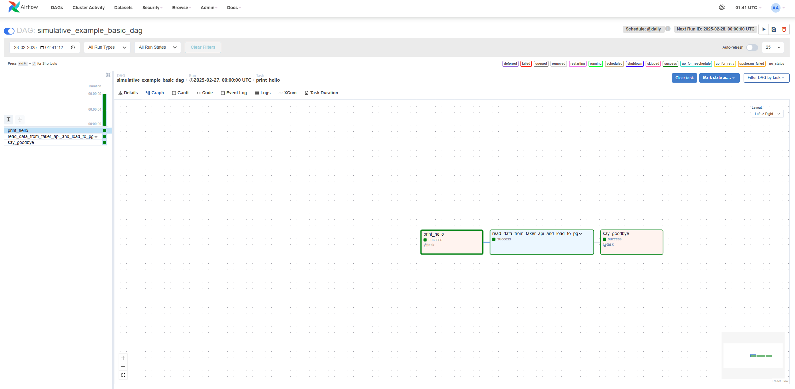
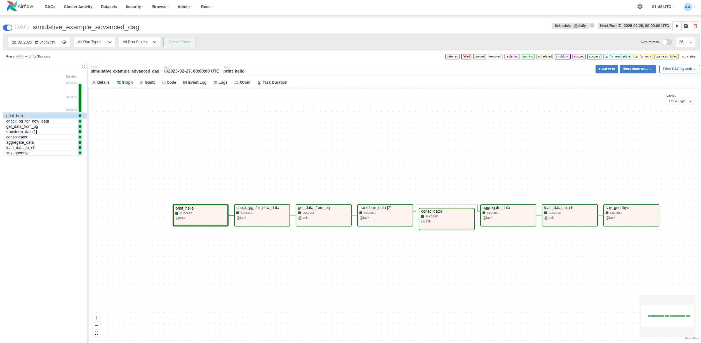

# Simulative. Webinar: FastApi + Airflow + Postgres + Clickhouse

## 1. Подготовим окружение

Создадим файл `.gitignore`

```bash
touch .gitignore
echo .idea >> .gitignore
echo .venv >> .gitignore
echo .env >> .gitignore
```

Инициализируем репозиторий

```bash
git init
```

Создадим виртуальное окружение

```bash
python -m venv .venv
source .venv/bin/activate
```

Установим необходимые зависимости

```bash
pip install -r requirements.txt
```

Настроим pre-commit

```yaml
# .pre-commit-config.yaml

repos:
  - repo: https://github.com/pre-commit/pre-commit-hooks
    rev: v4.5.0
    hooks:
      - id: check-merge-conflict
      - id: trailing-whitespace
        args: [--markdown-linebreak-ext=md]
      - id: end-of-file-fixer
      - id: check-toml
      - id: check-yaml
        args: ["--unsafe"]
      - id: check-symlinks
      - id: check-added-large-files
        args: ["--maxkb=3000"]
      - id: requirements-txt-fixer
      - id: detect-private-key

  - repo: https://github.com/psf/black
    rev: 24.2.0
    hooks:
      - id: black
        args:
          - --line-length=99
          - --exclude=/.venv/

  - repo: https://github.com/PyCQA/flake8
    rev: 7.0.0
    hooks:
      - id: flake8
        args:
          - --max-line-length=99
 ```

Установим pre-commit

```bash
pip install pre-commit
pre-commit install
```

Создадим makefile

```bash
# Makefile

SHELL := /bin/bash
PY = .venv/bin/python

.PHONY: up-services down-services up-af down-af lint

lint:
	pre-commit run --all-files
	pre-commit run --all-files

up-services:
	docker-compose -f docker-compose-services.yaml up -d --build

down-services:
	docker-compose -f docker-compose-services.yaml down -v

up-af:
	docker-compose -f docker-compose-af.yaml up -d --build

down-af:
	docker-compose -f docker-compose-af.yaml down -v
```

Подготовим файлы `.env` и `.env.example` с переменными окружения

```bash
# .env

PG_HOST=pg
PG_PORT=5432
PG_USER=postgres
PG_PASSWORD=postgres
PG_DATABASE=postgres
CH_HOST=ch
CH_PORT=8123
CH_USER=default
CH_PASSWORD=password
CH_DATABASE=default
AIRFLOW_UID=50000
AIRFLOW_GID=0
AIRFLOW_PROJ_DIR=./airflow
```

## 2. Напишем сервис на FastAPI, который будет генерировать фейковых пользователей

Создадим директорию нашего сервиса

```bash
mkdir fakerApi
```

Подготовим файл с зависимостями нашего сервиса

```bash
pip freeze >> fakerApi/requirements.txt
```

Подготовим Dockerfile для создания [Docker](https://www.docker.com/) образа нашего сервиса

```bash
# Dockerfile

FROM python:3.12-slim

WORKDIR /app

COPY requirements.txt .
RUN pip install --no-cache-dir -r requirements.txt

COPY . .

CMD ["uvicorn", "app.app:app", "--host", "0.0.0.0", "--port", "8000"]
```

Создадим директории нашего [FastAPI](https://fastapi.tiangolo.com/) приложения

```bash
mkdir app
mkdir app/models
touch app/models/person.py
mkdir app/handlers
touch app/handlers/person.py
touch app/app.py
```

Напишем модель ответа нашего приложения

```python
# fakerApi/app/models/person.py

import datetime
from pydantic import BaseModel
from typing import Optional


class PersonResponse(BaseModel):
    name: str
    age: int
    address: str
    email: str
    phone_number: str
    registration_date: datetime.datetime
    created_at: datetime.datetime
    updated_at: datetime.datetime
    deleted_at: Optional[datetime.datetime] = None
```

Напишем обработчик запроса к нашему приложению

```python
# fakerApi/app/handlers/person.py

from fastapi import APIRouter
from faker import Faker
from app.models.person import PersonResponse

router = APIRouter(prefix="/person", tags=["person"])

faker = Faker(locale="ru_RU")


@router.get("/", response_model=PersonResponse)
async def get_person():
    person = PersonResponse(
        name=faker.name(),
        age=faker.random_int(min=18, max=99),
        address=faker.address(),
        email=faker.email(),
        phone_number=faker.phone_number(),
        registration_date=faker.date_time_between(start_date="-1y", end_date="now"),
        created_at=faker.date_time_between(start_date="-1y", end_date="now"),
        updated_at=faker.date_time_between(start_date="-1y", end_date="now"),
        deleted_at=None,
    )
    return person
```

Напишем логику точки входа в наше приложение

```python
# fakerApi/app/app.py

import uvicorn
from fastapi import FastAPI
from app.handlers.person import router as person_router

app = FastAPI()

app.include_router(person_router)


@app.get("/")
async def root():
    return {"message": "Hello, Simulative!"}


if __name__ == "__main__":
    uvicorn.run(app, host="0.0.0.0", port=8000)
```

`docker-compose-services.yaml` напишем в следующем пункте

## 3. Поднимем инстансы Postgres, Clickhouse и fakerApi

Напишем `docker-compose-services.yaml`

```bash
# docker-compose-services.yaml

services:
  pg:
    image: postgres:latest
    container_name: pg
    env_file:
      - ./.env
    environment:
      - POSTGRES_PASSWORD=${PG_PASSWORD}
      - POSTGRES_USER=${PG_USER}
      - POSTGRES_DB=${PG_DATABASE}
    ports:
      - "5432:5432"
    healthcheck:
      test: /usr/bin/pg_isready
      interval: 10s
      timeout: 10s
      retries: 5
    restart: unless-stopped
    volumes:
      - ./init/pg:/docker-entrypoint-initdb.d

  zookeeper:
    image: zookeeper:latest
    container_name: zookeeper
    hostname: zookeeper

  ch:
    image: clickhouse/clickhouse-server:latest
    container_name: ch
    hostname: ch
    ports:
      - "8123:8123"
      - "9000:9000"
    volumes:
      - ./data/clickhouse/node1:/etc/clickhouse-server
      - ./data/clickhouse:/docker-entrypoint-initdb.d
    depends_on:
      - zookeeper
    healthcheck:
      test: wget --no-verbose --tries=1 http://127.0.0.1:8123/ping || exit 1
      interval: 10s
      timeout: 10s
      retries: 5

  faker-api:
    build: fakerApi
    ports:
      - "8000:8000"
    depends_on:
      pg:
        condition: service_healthy
      ch:
        condition: service_healthy
```

Создадим вспомогательные для инициализации Postgres директории и файлы

```bash
mkdir init
mkdir init/pg
touch init/pg/db.sql
```

Создадим файл для инициализации целевой таблицы, который будет исполняться при создании контейнера с Postgres

```sql
-- init/pg/db.sql

create extension if not exists "uuid-ossp";

create table if not exists person (
    id uuid default uuid_generate_v4() primary key,
    name varchar(256),
    age integer,
    address varchar(256),
    email varchar(256),
    phone_number varchar(256),
    registration_date timestamp with time zone,
    created_at timestamp with time zone,
    updated_at timestamp with time zone,
    deleted_at timestamp with time zone
);
```

Теперь cоздадим вспомогательные для инициализации Clickhouse директории и файлы

```bash
mkdir data
mkdir data/clickhouse
mkdir data/clickhouse/node1
touch data/clickhouse/node1/config.xml
touch data/clickhouse/node1/users.xml
mkdir init/ch
touch init/ch/db.sql
```

Заполним вспомогательные файлы содержимым

```xml
<!--data/clickhouse/node1/config.xml-->

<?xml version="1.0"?>
<company>
    <logger>
        <level>debug</level>
        <console>true</console>
        <log remove="remove"/>
        <errorlog remove="remove"/>
    </logger>

    <query_log>
        <database>system</database>
        <table>query_log</table>
    </query_log>

    <listen_host>0.0.0.0</listen_host>
    <http_port>8123</http_port>
    <tcp_port>9000</tcp_port>
    <interserver_http_host>clickhouse-node1</interserver_http_host>
    <interserver_http_port>9009</interserver_http_port>

    <max_connections>4096</max_connections>
    <keep_alive_timeout>3</keep_alive_timeout>
    <max_concurrent_queries>100</max_concurrent_queries>
    <uncompressed_cache_size>8589934592</uncompressed_cache_size>
    <mark_cache_size>5368709120</mark_cache_size>

    <path>/var/lib/clickhouse/</path>
    <tmp_path>/var/lib/clickhouse/tmp/</tmp_path>
    <user_files_path>/var/lib/clickhouse/user_files/</user_files_path>

    <users_config>users.xml</users_config>
    <default_profile>default</default_profile>
    <default_database>default</default_database>
    <timezone>Europe/Moscow</timezone>
    <mlock_executable>false</mlock_executable>

    <remote_servers>
        <company_cluster>
            <shard>
                <replica>
                    <default_database>shard</default_database>
                    <host>ch</host>
                    <port>9000</port>
                </replica>
            </shard>
        </company_cluster>
    </remote_servers>

    <zookeeper>
        <node index="1">
            <host>zookeeper-ch</host>
            <port>2181</port>
        </node>
    </zookeeper>

    <macros>
        <cluster>company_cluster</cluster>
        <shard>1</shard>
        <replica>ch</replica>
    </macros>

    <distributed_ddl>
        <path>/clickhouse/task_queue/ddl</path>
        <pool>default</pool>
    </distributed_ddl>

    <format_schema_path>/var/lib/clickhouse/format_schemas/</format_schema_path>
</company>
```

```xml
<!--data/clickhouse/node1/users.xml-->

<?xml version="1.0"?>
<company>
    <profiles>
        <default>
            <distributed_ddl_entry_format_version>2</distributed_ddl_entry_format_version>
            <max_memory_usage>10000000000</max_memory_usage>
            <use_uncompressed_cache>0</use_uncompressed_cache>
            <load_balancing>in_order</load_balancing>
            <log_queries>1</log_queries>
        </default>
    </profiles>

    <users>
        <default>
            <password>password</password>
            <profile>default</profile>
            <networks>
                <ip>::/0</ip>
            </networks>
            <quota>default</quota>
        </default>
        <admin>
            <password>123</password>
            <profile>default</profile>
            <networks>
                <ip>::/0</ip>
            </networks>
            <quota>default</quota>
        </admin>
    </users>

    <quotas>
        <default>
            <interval>
                <duration>3600</duration>
                <queries>0</queries>
                <errors>0</errors>
                <result_rows>0</result_rows>
                <read_rows>0</read_rows>
                <execution_time>0</execution_time>
            </interval>
        </default>
    </quotas>
</company>
```

Создадим файл для инициализации целевой таблицы, который будет исполняться при создании контейнера с Clickhouse

```sql
-- init/ch/db.sql

create table if not exists person_count_by_city (
    city String,
    name Int64
)
engine = MergeTree()
primary key city
order by city;
```

Запустим наши инстансы Postgres, Clickhouse и fakerApi с помощью команды `Makefile`

```bash
make up-services
```

Проверим работоспособность через IDE (dbeaver / datagrip) и curl

```bash
curl localhost:8000/person/

# {"name":"Миронова Полина Филипповна","age":85,"address":"д. Цимлянск, алл. Пограничная, д. 160 к. 49, 523868","email":"novikoveduard@example.com","phone_number":"8 (986) 389-0428","registration_date":"2024-04-23T18:33:50.346207","created_at":"2024-08-01T05:22:00.539628","updated_at":"2024-06-25T02:19:17.921913","deleted_at":null}
```

Все в порядке, наш сервис по генерации пользователей готов

## 4. Поднимем инстанс Airflow

Скачаем официальный docker-compose.yaml - [Running Airflow in Docker](https://airflow.apache.org/docs/apache-airflow/stable/howto/docker-compose/index.html)

```bash
curl -LfO 'https://airflow.apache.org/docs/apache-airflow/2.10.4/docker-compose.yaml'
mv docker-compose.yaml docker-compose-af.yaml
```

Пробросим наши соединения в Airflow. Для этого создадим необходимые директории и файлы

```bash
mkdir airflow
mkdir airflow/dags
mkdir airflow/logs
mkdir airflow/data
touch airflow/data/connections.yaml
```

Наполним `airflow/data/connections.yaml` содержимым

```yaml
# airflow/data/connections.yaml

postgres:
  conn_type: postgres
  host: pg
  schema: db
  login: postgres
  password: password
  port: 5432

ch:
  conn_type: clickhouse
  host: ch
  schema: default
  login: default
  password: password
  port: 9000

faker:
  conn_type: http
  host: faker-api
  schema: http
  port: 8000
```

Внесем небольшое изменение в `docker-compose-af.yaml`

```bash
# docker-compose-af.yaml

# line ~75
  environment:
    ...
    AIRFLOW__SECRETS__BACKEND: airflow.secrets.local_filesystem.LocalFilesystemBackend
    AIRFLOW__SECRETS__BACKEND_KWARGS: '{"connections_file_path": "/opt/airflow/data/connections.yaml"}'
  volumes:
    - ${AIRFLOW_PROJ_DIR:-.}/dags:/opt/airflow/dags
    - ${AIRFLOW_PROJ_DIR:-.}/logs:/opt/airflow/logs
    - ${AIRFLOW_PROJ_DIR:-.}/config:/opt/airflow/config
    - ${AIRFLOW_PROJ_DIR:-.}/plugins:/opt/airflow/plugins
    - ${AIRFLOW_PROJ_DIR:-.}/data:/opt/airflow/data
```

Запустим наш инстанс Airflow с помощью команды `Makefile`

```bash
make up-af
```

Проверим работу Airflow через UI, перейдя по адресу http://localhost:8080


Залогинившись, мы попадем на дашборд ДАГов, которые созданы в Airflow. В данном случае это ДАГи-примеры реализации различного функционала Airflow


## 5. Напишем наш первый DAG с использованием PythonOperator, TaskGroup, XCOM

Напишем DAG, в рамках которого будет происходить обращение к нашему сервису `fakerApi` для получения данных о пользователе, которые затем будут загружаться в Postgres

```bash
touch airflow/dags/simulative_example_basic_dag.py
```

```python
# airflow/dags/simulative_example_basic_dag.py

import datetime

from airflow.decorators import task, task_group
from airflow.models.dag import DAG


with DAG(
    dag_id="simulative_example_basic_dag",
    schedule="@daily",
    start_date=datetime.datetime(2025, 1, 1),
    catchup=False,
) as dag:

    @task
    def print_hello():
        print("Hello, Simulative!")

    @task_group(group_id="read_data_from_faker_api_and_load_to_pg")
    def read_data_from_faker_api_and_load_to_pg():
        @task
        def read_data_from_faker_api(ti):
            import requests
            from airflow.hooks.base import BaseHook

            faker_api_conn = BaseHook.get_connection("faker")

            response = requests.get(f"http://{faker_api_conn.host}:{faker_api_conn.port}/person")

            if response.status_code == 200:
                data = response.json()
                ti.xcom_push(key="data", value=data)
            else:
                print(f"Error: {response.status_code}")

        @task
        def load_data_to_pg(ti):
            import pandas as pd
            import sqlalchemy
            from airflow.hooks.base import BaseHook

            data = ti.xcom_pull(key="data")
            print(data)

            pg_conn = BaseHook.get_connection("postgres")

            dsn = f"postgresql://{pg_conn.login}:{pg_conn.password}@{pg_conn.host}"
            dsn += f":{pg_conn.port}/{pg_conn.schema}"

            pg_engine = sqlalchemy.create_engine(dsn)

            df = pd.DataFrame.from_dict(data, orient="index").T

            df.to_sql("person", pg_engine, if_exists="append", index=False)
            print(f"Loaded {len(df)} rows to PostgreSQL. Table: person")

        read = read_data_from_faker_api()

        load = load_data_to_pg()

        read >> load

    @task
    def say_goodbye():
        print("Goodbye, Simulative!")

    hello = print_hello()

    main = read_data_from_faker_api_and_load_to_pg()

    goodbye = say_goodbye()

    hello >> main >> goodbye
```

С помощью UI мы можем видеть визуальное отображение нашего DAG, включающего Task Group


## 5. Напишем продолжение нашего ETL процесса с использованием Dynamic Task Mapping

Напишем DAG, в рамках которого будет проверяться исходная таблица в Postgres на наличие новых данных, динамически создаваться задачи для обработки новых данных с последующей их агрегацией и загрузкой в Clickhouse

```bash
touch airflow/dags/simulative_example_advanced_dag.py
```

```python
# airflow/dags/simulative_example_advanced_dag.py

import datetime

from airflow.decorators import task, task_group
from airflow.models.dag import DAG


with DAG(
    dag_id="simulative_example_advanced_dag",
    schedule="@daily",
    start_date=datetime.datetime(2025, 1, 1),
    catchup=False,
    tags=["simulative"],
) as dag:

    @task
    def print_hello():
        print("Hello, Simulative!")

    @task
    def check_pg_for_new_data(ti):
        import time
        import sqlalchemy
        import psycopg2.extras
        from airflow.hooks.base import BaseHook

        query = "select min(updated_at) as dt from public.person"
        query += " where updated_at >= now() - interval '1 minute';"

        pg_conn = BaseHook.get_connection("postgres")

        dsn = f"postgresql://{pg_conn.login}:{pg_conn.password}@{pg_conn.host}"
        dsn += f":{pg_conn.port}/{pg_conn.schema}"

        pg_engine = sqlalchemy.create_engine(dsn)

        conn = pg_engine.raw_connection()

        with conn.cursor(cursor_factory=psycopg2.extras.RealDictCursor) as cur:
            while True:
                cur.execute(query)
                data = cur.fetchone()
                if data["dt"] is None:
                    print("No new data")
                    time.sleep(5)
                    continue
                else:
                    print(f"New data: {data['dt']}")
                    ti.xcom_push(key="dt", value=data["dt"])
                    return True

    @task
    def get_data_from_pg(ti):
        import sqlalchemy
        import pandas as pd
        import psycopg2.extras
        from airflow.hooks.base import BaseHook

        dt = ti.xcom_pull(key="dt")

        pg_conn = BaseHook.get_connection("postgres")

        dsn = f"postgresql://{pg_conn.login}:{pg_conn.password}@{pg_conn.host}"
        dsn += f":{pg_conn.port}/{pg_conn.schema}"

        pg_engine = sqlalchemy.create_engine(dsn)

        conn = pg_engine.raw_connection()

        with conn.cursor(cursor_factory=psycopg2.extras.RealDictCursor) as cur:
            cur.execute(f"select * from public.person where updated_at >= '{dt}';")
            data = cur.fetchall()

        df = pd.DataFrame(data)

        print(f"Got {len(df)} rows from PostgreSQL. Table: person")

        print(df.columns)

        df["id"] = df["id"].astype(str)
        df["city"] = df.apply(lambda row: row["address"].split(",")[0], axis=1)

        output = []

        for city in df["city"].unique():
            output.append(df[df["city"] == city].to_json(date_format="iso"))

        print(f"Got {len(output)} groups of rows from PostgreSQL. Table: person")

        return output

    @task_group(group_id="transform_data_and_aggregate")
    def transform_data_and_aggregate(data):

        @task
        def transform_data(data):
            import json
            import pandas as pd

            data = json.loads(data)

            df = pd.DataFrame(data)

            print(f"Got {len(df)} rows from PostgreSQL. Table: person")

            df = df.groupby("city").agg({"name": "count"}).reset_index().to_dict(orient="records")

            print(f"Got {len(df)} rows after aggregation. Table: person_count_by_city")

            return df

        @task
        def aggregate_data(data):
            import pandas as pd

            dfs = []

            for sample in data:
                dfs.append(pd.DataFrame.from_dict(sample, orient="index").T)

            df = pd.concat(dfs)

            print(f"Got {len(df)} rows from PostgreSQL. Table: person")

            return df.to_json(date_format="iso")

        t = transform_data(data)

        a = aggregate_data(t)

        return a

    @task
    def load_data_to_ch(data):
        import json
        import pandas as pd
        from clickhouse_driver import Client
        from airflow.hooks.base import BaseHook

        ch_conn = BaseHook.get_connection("ch")

        client = Client(
            host=ch_conn.host,
            port=ch_conn.port,
            database=ch_conn.schema,
            user=ch_conn.login,
            password=ch_conn.password,
        )

        xcom_data = list(data)

        dfs = []

        for sample in xcom_data:
            json_data = json.loads(sample)
            df = pd.DataFrame.from_dict(json_data, orient="index").T
            dfs.append(df)

        df = pd.concat(dfs)

        client.insert_dataframe(
            "INSERT INTO person_count_by_city VALUES", df, settings={"use_numpy": True}
        )

        print(f"Loaded {len(df)} rows to ClickHouse. Table: person_count_by_city")

    @task
    def say_goodbye():
        print("Goodbye, Simulative!")

    ph = print_hello()

    sensor = check_pg_for_new_data()

    extract = get_data_from_pg()

    transform = transform_data_and_aggregate.expand(data=extract)

    load = load_data_to_ch(transform)

    sg = say_goodbye()

    ph >> sensor >> extract >> transform >> load >> sg
```

С помощью UI мы можем видеть визуальное отображение нашего DAG


## 6. Пушим наши наработки на удаленный репозиторий

```bash
git remote add origin git@github.com:rushawx/airflowWebinarSimulative.git
git add .
git commit -m 'init'
git push --set-upstream origin main
```

Возможно `git add .` и `git commit -m 'init'` потребуется выполнить дважды из-за специфики работы pre-commit.

Все, поздравляю, вы прекрасны!
